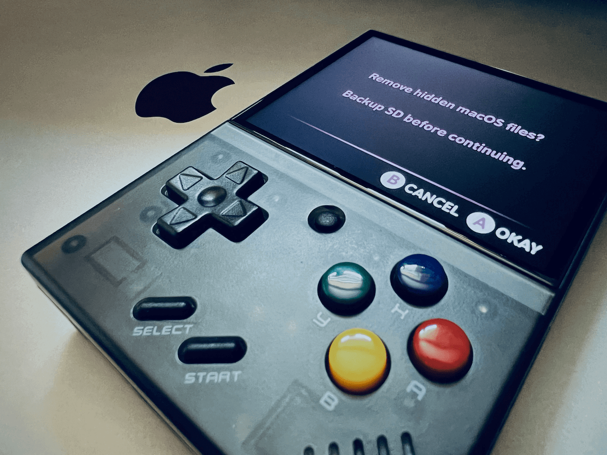

# macOS Dotfile Cleaner for DotUI

A simple macOS dotfile cleaner (`.DS_Store`, `.Trashes`, etc) for the [DotUI](https://github.com/Xpndable/DotUI) launcher on the Miyoo Mini Plus. While this tool should work in MiniUI on the Miyoo Mini as well, it has not been tested.

**Disclaimer: This tool removes data from your SD card. It is highly recommended to back up your SD card before using this tool. I am not responsible for any data loss that may occur. Use this tool at your own risk.**

## Installation
1. Download the `macOS Dotfile Cleaner.pak` file.
2. Drop `macOS Dotfile Cleaner.pak` into the `Tools` folder located at the root of your SD card.
   - If the `Tools` folder does not exist, please create it.
3. Access the DotUI main menu and navigate to the `Tools` menu.
4. Select `macOS Dotfile Cleaner` from the list of available tools.

That's it! Enjoy a clean SD card.
